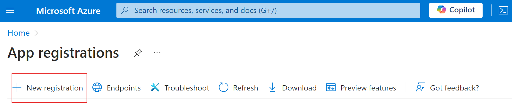
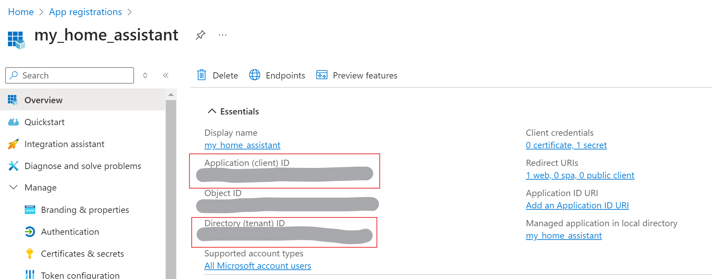
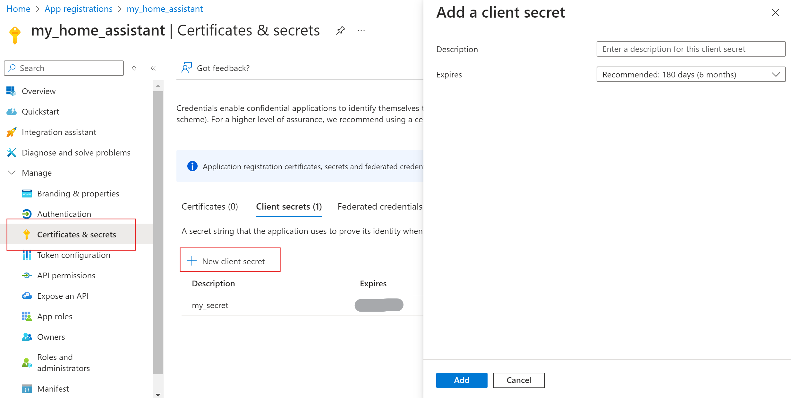

# 🎉 Transforming Voice Commands into Magic: Adding Items to Your Grocery List with a Voice Assistant! 🛒✨

Have you ever found yourself mid-cooking, realizing you just used the last bit of flour and thinking, "I should add this to the grocery list," only to forget it moments later? I personally faced this scenario countless times, and the frustration was real. That's when the light bulb went off 💡, and I decided it was time to enhance my home assistant with a practical new tool: a voice-activated grocery list manager!

## From Idea to Implementation: The Journey 🚀

The idea is simple. I wanted to be able to say, "Add flour to our shopping list", and have my home assistant handle it. Sounds practical, right? Here's how I turned this idea into reality.

### 👩‍🚀 The Quest for the Perfect API

First, I needed an application that could manage shared lists efficiently. My boyfriend and I had been using a small independent mobile app, which was great but lacked an API for integration. After some research, I stumbled upon Microsoft ToDo (also known as Microsoft Tasks) and realized it ticked all the boxes – comprehensive features and excellent API support.

## 🔧 The Azure  Setup

## App Registration
To connect my assistant with Microsoft ToDo, I needed to dive into the depths of the Microsoft Azure portal and register my application. This step was necessary to get the client ID, tenant ID, and client secret required for secure API access. Here is a small guide in case you need it:

1. Go to [Azure Portal](https://portal.azure.com/). You can normally log in with any personal Microsoft Account. 
2. Go to "App Registrations"
3. Select "New Registration"

4. Enter a name for your application and choose Supported account types.
In my case, only my app will access the application so I selected All Microsoft account users.
5. Once register, on the Overview page, pick the "Application (client) ID" and "Directory (tenant) ID" that will be useful for later.
6. 
7. Go to "Certificates & Secrets" and create a new secret. The secret must have an expiration date that can go up to 24 months for security reasons.

Carefully pick the value of the secret as you won't be able to access it later.

## API Access token

Next up was the tricky part – handling OAuth2 authentication for Microsoft Tasks. I struggled to find the correct way to authenticate my requests to the API until I discovered the [pymstodo open-source project](https://github.com/inbalboa/pymstodo) which I thank for the inspiration.

Here is the key: to access the API, you need an access token. This access token can be generated by opening an OAuth2Session with the authorize_url `https://login.microsoftonline.com/common/oauth2/v2.0/authorize` as follows:

```python
oa_sess = OAuth2Session(client_id,
                        scope='openid offline_access Tasks.ReadWrite',
                        redirect_uri='https://localhost/login/authorized')

authorize_url = "https://login.microsoftonline.com/common/oauth2/v2.0/authorize"
authorization_url, _ = oa_sess.authorization_url(authorize_url)
```
> Note:
> - The redirect_uri is the base uri of the link you will be redirected to once authorized. This link will contain an authorization code required for getting a token.
> - The scope defines the right that will be given by the token:
>   - openid is necessary to access user's profile
>   - offline_access will allow us to refresh the access_token once expired
>   - Tasks.ReadWrite allow us to read and write from the todo app

- Requiring an access_token by using the redirection link containing the authorization code: 
```python
token = oa_sess.fetch_token('https://login.microsoftonline.com/common/oauth2/v2.0/token', client_secret=client_secret, authorization_response=redirect_resp)
```
This token is a JSON object containing an `access_token` that is limited in time.

This process allows me to retrieve an `access_token`. However, the `access_token` will expire in one hour, and the process of obtaining a new one using the same method cannot be done by my assistant, as it requires opening a browser and copying/pasting the redirection link to the terminal.

To overcome this limitation, I created a script named `script_get_first_token.py` to acquire a token for the first time, storing it locally for ease of use.

Then, each time my assistant needs to access the To Do API, it will check if the access_token is still valid. If not, it will use the refresh_token from the JSON object to request a new access_token, and finally, replace the old JSON token with the new one.
```python
oa_sess = OAuth2Session(self.client_id, scope='openid offline_access Tasks.ReadWrite',
                                token=self.token, redirect_uri='https://localhost/login/authorized')

self.token = oa_sess.refresh_token('https://login.microsoftonline.com/common/oauth2/v2.0/token',
                                   client_id=self.client_id, client_secret=self.client_secret)
json.dump(self.token, open(self.token_file, 'w'))
```
   
> Note: I may not have hit all limitations of this process yet. It is possible that a token have a number of max refresh or something like this. I'll update this if I hit some and find a way to overcome it.

## 🛠️ Building the Tool

Once the API registration was sorted, it was time to craft the necessary tools:

### 🗂️ Abstracting the Essentials

At the core is an abstract `Tool class`. Each tool will implement this abstract class and require a name, a description, and a list of parameters to guide the assistant on when and how to use it. These values are essential, as they are necessary for defining most LLM tools in JSON. The real magic of a tool happens in the `execute` method, where the actual specific operations of the tool are defined.

I also decided to abstract the notion of `TodoTool` to gather all the upcoming tools that will require Todo API access. This approach allows managing authentication in a centralized place, including refreshing access tokens when needed.

Additionally, this is a good place to centralize functions that could be useful to most of these tools. For example, I created a simple function `_get_todo_list_from_name()` to allow easy retrieval of a Todo list from its name on the API.

### 🛒 Adding item to the grocery list

With everything in place, I implemented my abstract `TodoTool` class to create a specific tool for adding items to our grocery list. This tool relies on two primary parameters:

- the name of the List that requires an addition
- the name of the Item to add

These parameters will be generated on the fly by the assistant to dynamically add items to the list as the conversation flows.

## 🧠 Upgrading assistant with tool management

Adding tool management to the LLM engine is quite easy. All we need to do is pass the tool's JSON definition to the completion creation method. The LLM client will gather this information and integrate it into the final LLM prompt (the one hidden to our API's users' eyes). This way, whenever a tool execution is needed, the response will contain a reference to the tool(s) to call.

To handle this case of tool requirement, I enhanced the assistant's think function to:

- Execute the tool whenever needed
- Add the tool's result to the conversation
- Recursively call the 'think' method to generate a new assistant response that includes the tool's result.

## Final Thoughts 💭

Now, whenever I finish off the last bit of an ingredient, I can simply tell my assistant to add it to the grocery list, and it's done! No more forgetting items, no more extra trips to the store.

Integrating Microsoft To-Do was just the first step towards enhancing my assistant's utility and functionality.

With tool management now incorporated into the assistant's structure, expanding its capabilities will be key to making it a truly enjoyable and useful companion.

What capabilities do you envision for your assistant? Share your ideas and let us know how you'd like it to integrate into your daily routines! 🌟

---

Tags: #HomeAutomation #VoiceAssistant #MicrosoftToDo #TechInnovation #DIYAssistant